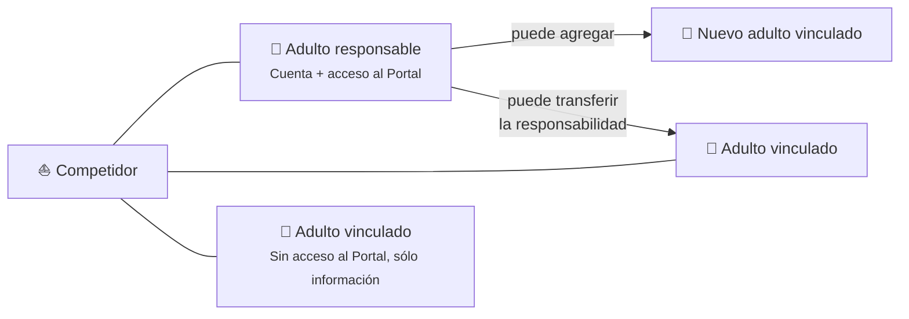

## Roles y permisos

Este portal funciona por roles y permisos, es decir que cada usuario ingresará con un tipo de rol que lo habilitará para acceder a distintas secciones y realizar diferentes acciones.

Los roles son:

- Adultos responsables (o guardianes o responsables de cuenta)
- Entrenadores
- Administradores de club
- Staff AOA
  - Tesorería
  - Medidores
  - Encargados de afiliados y adultos vinculados
  - Super Administradores

### Incumbencia de cada rol

| Acciones permitidas                                      |                                                                    **Adulto Responsable**                                                                     |                                                    **Entrenador**                                                    | **Tesorería** |                                          **Medidor**                                          |                                  **Encargados de afiliados**                                  |                                        **Super Admin**                                        |
| -------------------------------------------------------- | :-----------------------------------------------------------------------------------------------------------------------------------------------------------: | :------------------------------------------------------------------------------------------------------------------: | :-----------: | :-------------------------------------------------------------------------------------------: | :-------------------------------------------------------------------------------------------: | :-------------------------------------------------------------------------------------------: |
| Crear cuentas nuevas de afiliados                        |                                 SI                                 |                                                          No                                                          |      No       |                                              No                                               | SI |                                              Si                                               |
| Modificar cuentas de afiliados                           |                                SI\*                                |                                                          No                                                          |      No       |                                              No                                               | SI | SI |
| Editar y agregar adultos vinculados                      | SI Sólo los relacionados a los afiliados de los que es responsable |                                                          No                                                          |      No       |                                              No                                               | SI | SI |
| Reservar turnos de medición                              |                                                                              No                                                                               | SI, sólo para sus alumnos |      No       | SI | SI | SI |
| Tomar posesión de barcos                                 |                                SI\*                                |                                                          No                                                          |      No       |                                              No                                               | SI | SI |
| Disputar barcos                                          |                                SI\*                                |                                                          No                                                          |      No       |                                              No                                               |                                              No                                               |                                              No                                               |
| Informar pagos                                           |                                SI\*                                |                                                          No                                                          |      No       |                                              No                                               | SI | SI |
| Habilitar medición aun sin pagos aprobados por tesorería |                                                                              No                                                                               |                                                          No                                                          |      No       | SI |                                              No                                               | SI |

💡 SI\* = Sólo de los afiliados de los cuales es responsable

<Callout type="info" title="Adultos vinculados y responsables">
  La cuenta de cada competidor tiene información sobre el competidor y datos de
  contacto de los adultos vinculados al mismo (padre, madre, tutor, contacto de
  emergencia, etc) Cada competidor podrá tener varios adultos vinculados pero
  sólo uno de ellos tendrá acceso al portal para manipular los datos del
  competidor a cargo. A ese adulto lo llamamos **adulto responsable** o
  **responsable de cuenta**. Los demás son sólo adultos vinculados. Un adulto
  responsable puede tener varios competidores a su cargo, por ejemplo un padre
  con dos hijos.
</Callout>

## Esquema de relación entre competidores y adultos

