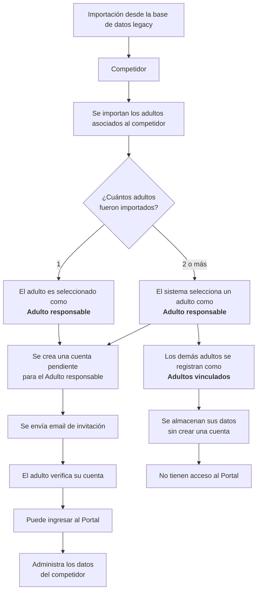
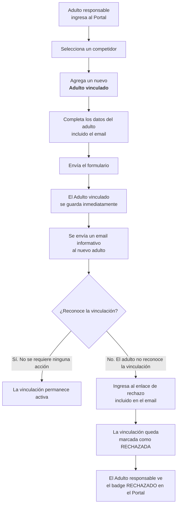
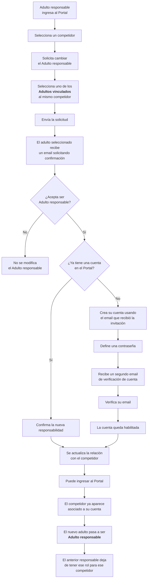

## Importación de datos

Al momento de habilitar el portal se importaron los siguientes datos de la base de datos anterior:

- Nombre, apellido, email, teléfono de padre, madre y contacto de emergencia de cada competidor
- Nombre, apellido, email, teléfono y DNI del competidor
- Nro de serie, nro de vela y demás datos de los barcos
- Estado de los pagos de cada competidor

Al portal anterior se ingresaba con el DNI del competidor y una clave, mientras que para este nuevo portal, el acceso no se hará con el DNI del competidor, sino con el email de un ADULTO RESPONSABLE. Al importar los datos, el sistema eligió como adulto responsable a uno de los dos padres del competidor, y creó cada cuenta con el email de dicho adulto.

Para poder ingresar al sistema, cada adulto así seleccionado recibirá un email con una invitación para resetear la contraseña y así acceder al nuevo portal, luego de validar sus datos.

## Validación de datos

Dado que este nuevo portal requiere de los números de DNI de los adultos para asegurar la unicidad de los datos, es muy probable que, una vez reseteado el password, los adultos deban completar o editar sus datos (nombre, apellido y DNI) para así validar su identidad. Una vez validada la identidad, el adulto podrá ingresar al sistema, el cual ya tendrá cargados los datos del competidor o los competidores a cargo.

## Diagramas conceptuales

### Importación de cuentas

### Agregado de adulto vinculado

    <Callout type="idea" title="La incorporación de un adulto vinculado no requiere aceptación">La vinculación se crea en el momento en que el Adulto responsable envía el formulario. El email recibido por el nuevo adulto tiene carácter informativo y permite rechazar la vinculación si no la reconoce.</Callout>

    ### Cambio de adulto responsable

## Videos explicativos

Hacer click en el título para ver el video en Youtube.

|                                                                          | Título                                                                                                                                                                                               | Descripción                                                                                                                  |
| ------------------------------------------------------------------------ | ---------------------------------------------------------------------------------------------------------------------------------------------------------------------------------------------------- | ---------------------------------------------------------------------------------------------------------------------------- |
|  | <a href="https://www.youtube.com/watch?v=Y32vHqsemGU&list=PLT-U0qW5T4Eo&index=13&pp=iAQBsAgC" target='_blank'>Cuentas importadas: email de invitación al adulto responsable</a>                      | Introducción a la importación de los datos desde la base de datos vieja (legacy), adultos responsables e email de invitación |
|  | <a href="https://www.youtube.com/watch?v=667lDDIXlSw&list=PLT-U0qW5T4Eo&index=11&pp=iAQBsAgC" target='_blank'>Cuentas importadas: reseteo de password, validación de datos e ingreso a la cuenta</a> | Aceptación de la invitación a crear la cuenta, reseteo de password y carga de datos faltantes                                |
|  | <a href="https://www.youtube.com/watch?v=72qImDL698I&list=PLT-U0qW5T4Eo&index=12&pp=iAQBsAgC" target='_blank'>Cuentas importadas: recorrido por panel de control</a>                                 | Un recorrido por la pantalla principal del portal para los usuarios con rol de adultos responsables                          |
|  | <a href="https://www.youtube.com/watch?v=gmaBT1TmFWA&list=PLT-U0qW5T4Eo&index=15&pp=iAQBsAgC" target='_blank'>Cuentas importadas: cambio de adulto responsable</a>                                   | Pasos a seguir para agregar un nuevo adulto vinculado y eventualmente transformarlo en adulto responsable                    |
