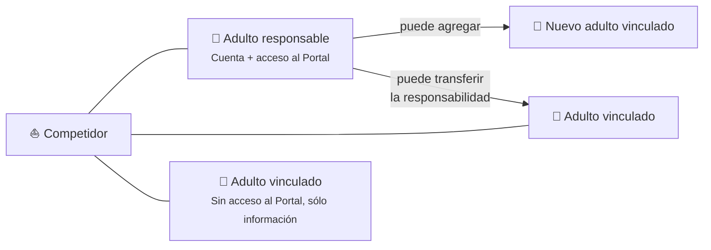
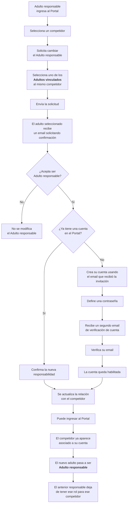

import { User, CircleDollarSign, Sailboat } from "lucide-react";
import { docsIconColors } from "@/lib/icon-colors";

## 👨‍👩‍👧

## ¿Quiénes son los adultos responsables?

Un adulto responsable es un adulto vinculado a un afiliado (también llamado competidor) y que tiene una cuenta en el portal, es decir que puede acceder al portal con usuario y contraseña.

Normalmente, los adultos responsables son automáticamente designados como tales al momento de cargar un nuevo afiliado, cuando dicho adulto no tenía una cuenta preexistente.

Un adulto responsable puede solicitar que otro adulto ya vinculado al competidor asuma la responsabilidad. La AOA puede iniciar el mismo proceso.

## Tareas que puede / debe realizar un adulto responsable

<Cards className="grid-cols-1">
  <Card
    className="rounded-2xl w-full shadow-none transition-all hover:-translate-y-0.5 flex gap-4 items-center p-0 border-none hover:bg-transparent"
    title="Crear nuevos afiliados"
    icon={<User color={docsIconColors.rosa} />}
    href="./crear-un-afiliado"
  />
  <Card
    className="rounded-2xl w-full shadow-none transition-all hover:-translate-y-0.5 flex gap-4 items-center p-0 border-none hover:bg-transparent"
    title="Informar pagos"
    icon={<CircleDollarSign color={docsIconColors.rosa} />}
    href="./informar-pagos"
  />
  <Card
    className="rounded-2xl w-full shadow-none transition-all hover:-translate-y-0.5 flex gap-4 items-center p-0 border-none hover:bg-transparent"
    title="Administrar barcos"
    icon={<Sailboat color={docsIconColors.rosa} />}
    href="./administrar-barcos-afiliados"
  />
</Cards>

## Esquema de relación entre competidores y adultos

## Cómo cambiar de adulto responsable

En la ficha del competidor, dentro de **Adultos vinculados**, usá **Cambiar adulto responsable**, elegí otro adulto con un vínculo activo y confirmado y presioná **Solicitar cambio de responsable**. El adulto elegido recibirá un email para aceptar o rechazar.

- Si ya tiene una cuenta con email verificado, sólo necesita aceptar la responsabilidad para ese competidor.
- Si no tiene cuenta, debe aceptar la responsabilidad, crear su cuenta y verificar su email mediante el correo de confirmación. Puede completar la aceptación y el alta de cuenta en cualquier orden.
- Hasta que se cumplan ambas condiciones, el adulto actual sigue siendo responsable. Crear una cuenta o aceptar por separado no completa el cambio ni habilita el acceso de la cuenta nueva al portal.
- Rechazar la solicitud mantiene al adulto como vinculado y no cambia al responsable actual.

La invitación dura 30 días. Enviar una nueva solicitud reemplaza la anterior.

Cuando el cambio se completa, el adulto anterior conserva su cuenta y su vínculo con el competidor. Si no es responsable de otro competidor, pierde el acceso como adulto responsable. Si tiene otro rol activo, como entrenador o personal AOA, conserva el acceso de ese rol; de lo contrario, su perfil queda inactivo. Si más adelante acepta una nueva responsabilidad, puede volver a usar la misma cuenta.

### Diagrama de pasos a seguir para cambiar el adulto responsable

